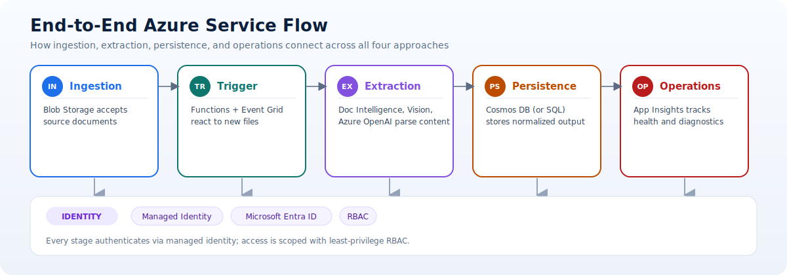
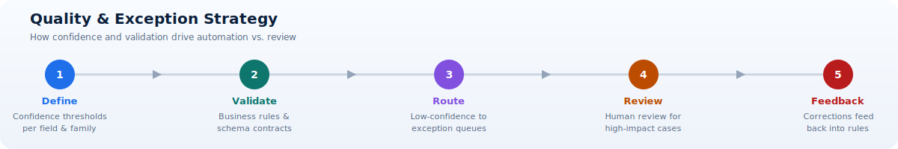

# Fundamentals

This view consolidates the Azure services referenced across all four repositories and explains how they work together in the end-to-end document ETL pipeline.

It is designed to provide a common language for technical and non-technical stakeholders before they choose a specific implementation approach.

## Repositories in scope

- [PDFs-Invoice-Processing-Fapp-DocIntelligence](https://github.com/Cloud2BR-MSFTLearningHub/PDFs-Invoice-Processing-Fapp-DocIntelligence)
- [PDFs-Layouts-Processing-Fapp-DocIntelligence](https://github.com/Cloud2BR-MSFTLearningHub/PDFs-Layouts-Processing-Fapp-DocIntelligence)
- [PDFs-MultiLayout-VisualCue-AzureAI-Document-Processing](https://github.com/Cloud2BR-MSFTLearningHub/PDFs-MultiLayout-VisualCue-AzureAI-Document-Processing)
- [PDFs-Invoice-Processing-Fapp-OpenFramework](https://github.com/Cloud2BR-MSFTLearningHub/PDFs-Invoice-Processing-Fapp-OpenFramework)

## End-to-end flow

1. Documents are uploaded to Azure Storage Blob containers.
2. Event-driven processing is triggered by Azure Functions (via blob trigger and/or Event Grid subscription patterns).
3. Extraction and understanding run through Azure AI services:
	- Azure AI Document Intelligence for invoice/layout extraction.
	- Azure AI Vision for visual cue detection in multi-layout scenarios.
	- Azure OpenAI for semantic interpretation and enrichment in advanced scenarios.
4. Structured outputs are validated and stored in Azure Cosmos DB (and optionally Azure SQL Database, depending on workload preference).
5. Telemetry and diagnostics are tracked through Application Insights.
6. Access is secured with managed identities, Microsoft Entra ID, and RBAC assignments.

## Why this flow matters

- It separates ingestion, extraction, normalization, and integration responsibilities so each stage can scale and evolve independently.
- It provides clear quality gates where confidence and validation rules can be applied.
- It supports incremental rollout because each stage can be improved without rewriting the full pipeline.
- It creates auditable checkpoints for compliance and operational troubleshooting.

## Azure services overview

| Azure service | How it works in these implementations | Where used |
| --- | --- | --- |
| Azure Resource Group | Logical boundary that groups all resources for lifecycle management, permissions, and tagging. | All four repos |
| Azure Storage Account (Blob) | Stores source PDFs/images and acts as the ingestion boundary. New blob writes trigger downstream processing. | All four repos |
| Azure Functions / Function App | Serverless execution layer that reacts to upload events, orchestrates extraction logic, and writes normalized outputs. Hosting plans vary by latency and scale requirements. | All four repos |
| Azure AI Document Intelligence | Core extraction engine for prebuilt invoice and layout models. Reads documents and returns structured fields, tables, key-value pairs, and layout elements. | Invoice DocInt, Layout DocInt, Multi-Layout Visual Cue |
| Azure AI Vision | Detects visual patterns and cues (checkmarks, highlights, selected regions) to complement layout extraction when templates vary. | Multi-Layout Visual Cue |
| Azure OpenAI | Adds semantic reasoning on extracted content and context-aware interpretation where deterministic extraction alone is not enough. | Multi-Layout Visual Cue |
| Azure Cosmos DB (NoSQL) | Persists extracted and enriched document payloads at scale with low-latency access and flexible schema support. | All four repos |
| Azure SQL Database (optional pattern) | Alternate persistence option for relational-heavy workloads that require strict schema and transactional queries. | Mentioned in Layout/OpenFramework architecture guidance |
| Azure Event Grid (System Topics / subscriptions) | Event routing pattern for blob-created events to serverless handlers; enables real-time decoupled processing. | Explicitly discussed in Layout and Multi-Layout repos |
| Application Insights | Centralized telemetry for function execution traces, errors, performance diagnostics, and operational analysis. | All function-based repos |
| Managed Identity + Microsoft Entra ID + RBAC | Identity and access model for secure service-to-service authentication and least-privilege authorization without storing credentials in code. | All four repos |

## Concepts behind the services

- Event-driven processing: New file arrival becomes the trigger for work, reducing polling overhead and improving responsiveness.
- Schema normalization: Different source formats are transformed into a stable internal model so downstream systems receive predictable outputs.
- Confidence management: Extraction confidence is treated as a business signal used to automate acceptance, rejection, or human review.
- Contract-first integration: Downstream APIs and databases should consume versioned payload contracts to avoid breaking changes.
- Observability by design: Logs, metrics, and traces should be created as part of the pipeline architecture, not added later.

## Service interaction model

- Ingestion: Storage accepts document uploads.
- Triggering: Function runtime receives event notifications and starts processing.
- Extraction: Document Intelligence and optional Vision/OpenAI process raw content.
- Persistence: Cosmos DB (or optional SQL) stores normalized outputs.
- Operations: Application Insights captures processing health and diagnostics.
- Security: Managed identities and RBAC enforce controlled access across services.

## Quality and exception strategy

1. Define minimum confidence thresholds per critical field and per document family.
2. Validate extracted payloads against business rules and schema contracts.
3. Route low-confidence or invalid outputs into exception queues.
4. Add human review workflows for high-impact exceptions.
5. Feed validated corrections back into rule updates and template onboarding.

## Performance and cost fundamentals

- Throughput: Tune function concurrency, queue/batch settings, and payload size.
- Latency: Track document arrival-to-output duration and stage-level timing.
- Cost drivers: AI extraction calls, function execution duration, storage operations, and data retention.
- Optimization: Use lifecycle policies, right-size hosting plans, and route documents to the simplest effective pattern.

## Document lifecycle in detail

A reliable pipeline records state transitions explicitly. This avoids guessing whether a document is still processing, failed permanently, or was delivered twice.

| State | Meaning | Recommended evidence |
| --- | --- | --- |
| Received | File and metadata reached the controlled ingestion boundary | Document ID, content hash, source, timestamp |
| Validated | File passed format, size, malware, and metadata checks | Validation result and policy version |
| Classified | Document type or template family was selected | Classification label, confidence, classifier version |
| Extracted | AI or deterministic processing produced candidate fields | Raw response reference, model and API version |
| Normalized | Candidate fields were mapped to the canonical contract | Contract version, mapping version, validation results |
| Reviewed | A person approved or corrected uncertain output | Reviewer, reason code, corrections, timestamp |
| Delivered | An accepted payload reached the downstream destination | Destination, idempotency key, acknowledgement |
| Failed or quarantined | Processing cannot continue automatically | Failure category, retry count, remediation owner |

Use a correlation ID from ingestion through delivery. The same ID should appear in application logs, queue messages, storage metadata, review records, and downstream acknowledgements. This makes an end-to-end transaction traceable without exposing document contents in logs.

## Canonical data contract

Model responses are provider-specific and can change as API versions evolve. A canonical contract isolates downstream systems from those details. It should normally contain:

- Identity: Document ID, source system, source filename, content hash, and received timestamp.
- Classification: Business document type, template family, and routing decision.
- Business fields: Normalized names, values, units, currencies, dates, and line items.
- Quality metadata: Field confidence, validation outcome, review status, and exception codes.
- Provenance: Model, API, mapping, rule, and contract versions used for processing.
- Operational metadata: Processing timestamps, retry count, region, and correlation ID.

Version the contract with explicit compatibility rules. Additive optional fields are easier for consumers to absorb than renamed or retyped fields. For breaking changes, publish a new contract version and support a controlled migration period.

## Quotas, throttling, and backpressure

Azure service quotas vary by service tier, region, API, and subscription. Verify current limits in the target environment rather than copying values from a prototype. Design the pipeline so temporary capacity constraints slow processing safely instead of losing work.

1. Buffer work in a durable queue between ingestion and processing.
2. Limit function concurrency to a level downstream AI and database services can sustain.
3. Treat throttling responses as transient and retry with exponential backoff and jitter.
4. Cap retry attempts and move exhausted items to a poison queue with diagnostic context.
5. Monitor queue age, not only queue length; old messages reveal whether service levels are at risk.
6. Request quota increases before planned volume events and load-test the approved limits.

Backpressure is intentional flow control. If extraction slows, ingestion can continue accepting files while the queue absorbs the difference within defined capacity. Alerts should fire before the backlog exceeds the recovery window.

## Model and API lifecycle

Managed AI services reduce model-hosting work but still require lifecycle discipline.

- Pin supported API versions rather than silently adopting preview behavior.
- Record model and API versions for every processed document.
- Test upgrades against the golden dataset before production rollout.
- Compare field-level outcomes, not only overall document success.
- Use staged deployment or shadow evaluation for material changes.
- Retain rollback instructions and the previous known-good configuration.

Confidence scores are not universal probabilities. Their distribution can differ by model, field, language, scan quality, and template family. Calibrate them empirically against reviewed business outcomes.

## Testing strategy

### Unit tests

Test deterministic code such as file validation, field normalization, arithmetic checks, date parsing, mapping, and exception classification without calling cloud services.

### Contract tests

Verify that canonical payloads satisfy schema requirements and that downstream adapters handle compatible contract versions. Include missing optional fields, extra fields, null values, and malformed inputs.

### Integration tests

Exercise real service boundaries in a non-production environment: upload a document, trigger processing, call extraction, write persistence, and verify telemetry. Use isolated resources and synthetic or approved test data.

### Golden-dataset evaluation

Maintain reviewed documents with expected field values and document-family labels. Include ordinary examples, rare variants, low-quality scans, multi-page files, and known past failures. Run the full set whenever models, prompts, rules, mappings, or API versions change.

### Load and resilience tests

Validate peak volume, throttling, dependency timeouts, duplicate messages, transient failures, poison-message handling, and replay. Confirm that retries do not create duplicate downstream records.

## Data retention and deletion

Define retention separately for source files, raw extraction responses, normalized records, logs, human-review artifacts, and backups. These assets may have different legal and operational needs.

- Apply lifecycle policies to move old source documents to cooler tiers or delete them when permitted.
- Avoid placing document text or sensitive fields in general application logs.
- Ensure deletion workflows include derived data, replicas, search indexes, and review systems where required.
- Retain enough provenance to explain past processing decisions without retaining unnecessary sensitive content.
- Test deletion and legal-hold procedures before relying on them for compliance.

## Troubleshooting by symptom

| Symptom | Likely causes | First checks |
| --- | --- | --- |
| Growing queue age | Throttling, reduced function capacity, slow dependency | Dependency response codes, concurrency, recent volume |
| Sudden quality drop | New template, scan degradation, model/API change | Segment by source and family, compare versions |
| Duplicate downstream records | Retry without idempotency, repeated source event | Content hash, event ID, delivery acknowledgement |
| Missing documents | Trigger configuration, filter rule, permissions | Storage event, subscription health, dead-letter destination |
| Rising human review | Threshold drift, new layouts, mapping failures | Reason codes, confidence distribution, family mix |
| Cost spike | Page-volume growth, retry loop, retention growth | Usage by service and stage, failed-call volume, storage tier |

## How to use this overview

- Use this page to understand the common Azure baseline across all four approaches.
- Use [Overview and Decision Guide](../02-approaches/index.md) to select the implementation path.
- Then open each deep-dive page in [02. Approaches Catalog](../02-approaches/index.md) for approach-specific architecture and trade-offs.

!!! note
	This page provides the shared platform baseline. The approach pages explain how each pattern changes extraction logic, routing complexity, and operating model.
