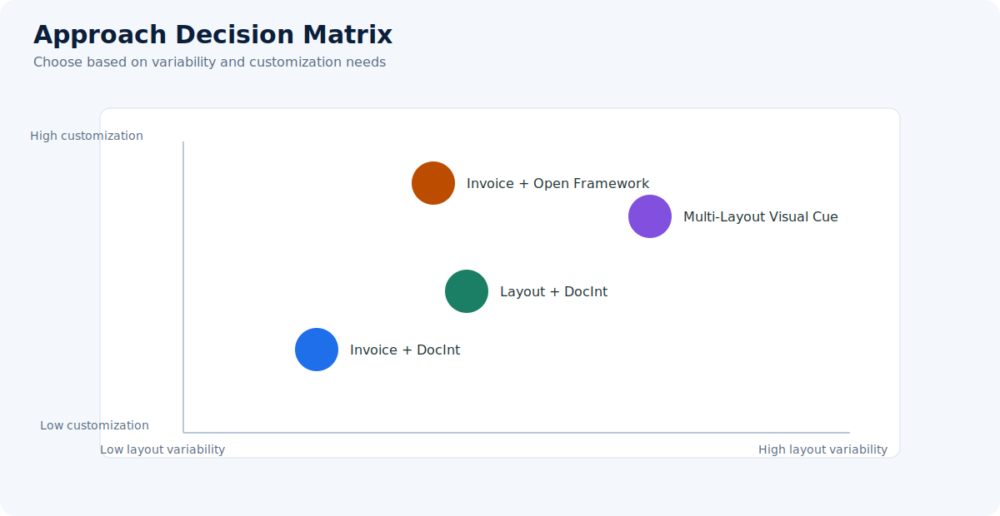
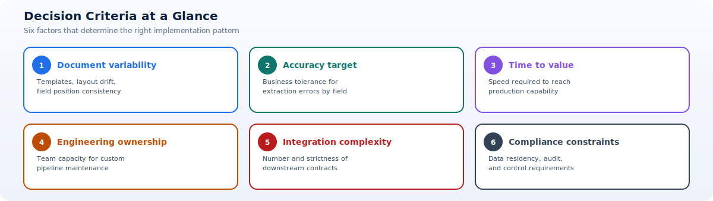

# Overview and Decision Guide

Use this page as the selection entry point for the four implementation repositories.

The purpose is not only to compare features, but to align pattern selection with document behavior, delivery constraints, and long-term ownership.

## Quick comparison

| Approach | Strengths | Watchouts | Repo |
| --- | --- | --- | --- |
| Invoice + Document Intelligence | Fast onboarding, high precision for invoice fields, managed model lifecycle | Less flexible for highly unusual invoice formats | [PDFs-Invoice-Processing-Fapp-DocIntelligence](https://github.com/Cloud2BR-MSFTLearningHub/PDFs-Invoice-Processing-Fapp-DocIntelligence) |
| Layout + Document Intelligence | Works across broad PDF layouts, keeps structural context | Requires stronger post-processing rules | [PDFs-Layouts-Processing-Fapp-DocIntelligence](https://github.com/Cloud2BR-MSFTLearningHub/PDFs-Layouts-Processing-Fapp-DocIntelligence) |
| Multi-Layout Visual Cue | Handles mixed templates and positional anchors well | More complex routing and visual rule maintenance | [PDFs-MultiLayout-VisualCue-AzureAI-Document-Processing](https://github.com/Cloud2BR-MSFTLearningHub/PDFs-MultiLayout-VisualCue-AzureAI-Document-Processing) |
| Invoice + Open Framework | Maximum extensibility and custom business logic integration | Higher engineering ownership and governance needs | [PDFs-Invoice-Processing-Fapp-OpenFramework](https://github.com/Cloud2BR-MSFTLearningHub/PDFs-Invoice-Processing-Fapp-OpenFramework) |

## Decision criteria explained

| Criterion | What to evaluate | Why it matters |
| --- | --- | --- |
| Document variability | Number of templates, layout drift, and field position consistency | Determines whether simple extraction is sufficient or routing logic is required |
| Accuracy target | Business tolerance for extraction errors by field and process | Drives confidence thresholds and review strategy |
| Time to value | How quickly the team must deliver production capability | Influences managed-first versus custom-first approach |
| Engineering ownership | Team capacity for custom pipeline maintenance | Higher ownership enables flexibility but increases operational burden |
| Integration complexity | Number and strictness of downstream contracts and systems | Impacts normalization logic and orchestration depth |
| Compliance constraints | Data residency, audit, and control requirements | Affects storage, access model, and evidence workflows |

## Decision flow

- If your documents are mostly invoices with stable fields, start with **[Invoice + Document Intelligence](invoice-docint.md)**.
- If document types vary and table/structure extraction is key, use **[Layout + Document Intelligence](layout-docint.md)**.
- If you have many vendor templates and positional markers, use **[Multi-Layout Visual Cue](multilayout-visualcue.md)**.
- If you need a highly customizable and pluggable pipeline, choose **[Invoice + Open Framework](invoice-openframework.md)**.

## Practical selection workflow

1. Pick one representative document set for each major business flow.
2. Score each set on variability, required accuracy, and integration complexity.
3. Select the simplest pattern that can satisfy quality and control requirements.
4. Run a short pilot to measure extraction accuracy, latency, and exception rate.
5. Confirm operational readiness before expanding to additional document families.

!!! tip
	Start conservative: if two approaches seem viable, choose the lower-complexity option first and add complexity only when metrics prove the need.
