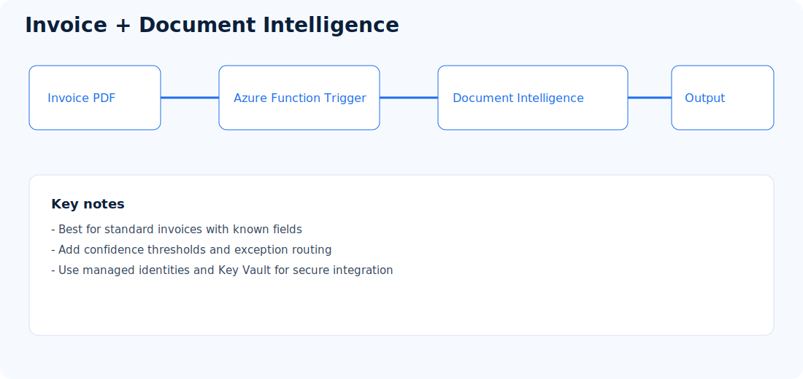
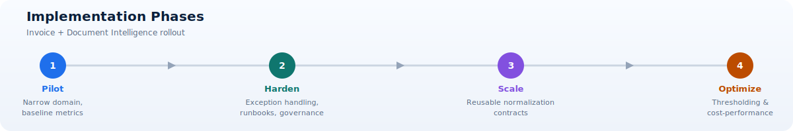

# Invoice Processing with Document Intelligence

**Repository:** [PDFs-Invoice-Processing-Fapp-DocIntelligence](https://github.com/Cloud2BR-MSFTLearningHub/PDFs-Invoice-Processing-Fapp-DocIntelligence)

  

## What this approach does

Processes invoice PDFs using Azure Functions and Azure AI Document Intelligence to extract normalized invoice fields for downstream systems.

It focuses on rapid delivery by using prebuilt invoice intelligence while still allowing enterprise controls around quality, exceptions, and auditability.

## Typical flow

1. Ingest invoice PDF into storage.
2. Trigger Function App processing.
3. Run Document Intelligence invoice extraction.
4. Validate and normalize extracted fields.
5. Persist output in storage/DB and publish integration event.

## Concepts explained

- Prebuilt invoice model: A managed model optimized for common invoice entities such as vendor, invoice number, dates, totals, tax, and line items.
- Normalization contract: A stable output schema that downstream systems can trust regardless of source invoice format.
- Confidence thresholding: A policy layer that decides whether fields are auto-accepted, auto-rejected, or sent for review.
- Exception path: A controlled process for documents that fail extraction quality checks or business validation rules.

## Best fit

- AP automation and invoice reconciliation.
- Known invoice patterns with moderate template variation.
- Teams prioritizing managed AI service acceleration.

## Architecture responsibilities

- Ingestion layer: Collects invoice files and metadata from upstream channels.
- Extraction layer: Calls Document Intelligence and receives structured invoice output.
- Validation layer: Enforces required fields, value ranges, and consistency checks.
- Integration layer: Delivers approved records to ERP, finance, or data platforms.
- Operations layer: Captures traces, metrics, and errors for support and optimization.

## Strengths

- Fast time to value.
- Strong built-in invoice extraction.
- Lower ML operations burden.

## Quality model recommendations

1. Define field criticality tiers, for example payment amount and due date as high criticality.
2. Set confidence thresholds per field tier instead of one global threshold.
3. Capture confidence distribution by vendor and template to identify drift.
4. Create deterministic fallback rules for known weak fields.
5. Track false-positive and false-negative rates from reviewed samples.

## Considerations

- Add confidence threshold handling for low-confidence fields.
- Implement retry and dead-letter strategy for failed documents.
- Keep a human-in-the-loop fallback for edge cases.

## Implementation phases

1. Pilot: Start with a narrow invoice domain and baseline quality metrics.
2. Harden: Add exception handling, runbooks, and governance controls.
3. Scale: Onboard new invoice families using reusable normalization contracts.
4. Optimize: Improve thresholding and cost-performance ratios with real data.
