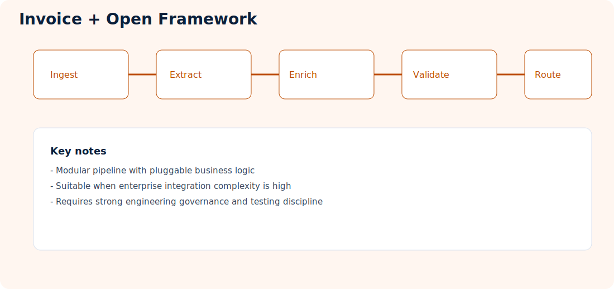
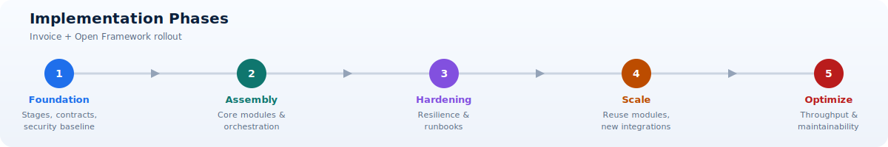

# Invoice Processing with Open Framework

**Repository:** [PDFs-Invoice-Processing-Fapp-OpenFramework](https://github.com/Cloud2BR-MSFTLearningHub/PDFs-Invoice-Processing-Fapp-OpenFramework)

  

!!! info "At a glance"
    Use this pattern when custom orchestration and reusable business processors provide clear value and the organization can operate a software platform over time.

> **Best-fit signal:** Choose extensibility only when custom stages create enough business value to justify permanent platform ownership.

## What this approach does

Implements invoice ETL using an open and modular framework, enabling custom orchestration steps, enrichment, and integration logic.

It prioritizes flexibility and long-term extensibility for teams that need deeper control than managed defaults can provide.

## Typical flow

1. Receive invoices from ingestion channel.
2. Execute modular extraction and enrichment stages.
3. Apply domain-specific validation and policy checks.
4. Route accepted records to business systems.
5. Send exceptions for remediation workflows.

## Concepts explained

- Open framework pipeline: A composable architecture where each stage can be added, replaced, or extended independently.
- Custom processors: Plug-in components for domain-specific parsing, enrichment, and validation.
- Policy-driven orchestration: Rules that determine stage order, branching, and exception outcomes.
- Contract governance: Versioned interfaces between pipeline stages and downstream consumers.

## Best fit

- Teams needing fine-grained extensibility and custom plug-ins.
- Complex business logic not covered by managed defaults.
- Architectures where portability and framework control matter.

## Architecture responsibilities

- Intake layer: Accepts source invoices and captures processing context.
- Processing layer: Executes modular extraction, enrichment, and policy checks.
- Orchestration layer: Coordinates branching, retries, and exception routes.
- Integration layer: Delivers approved outputs to enterprise systems.
- Platform layer: Enforces telemetry, security controls, and operational standards.

## Strengths

- Full control over pipeline behavior.
- Easy extension with custom processors/connectors.
- Strong fit for enterprise integration patterns.

## Design guidance

1. Define stage contracts before implementing custom processors.
2. Keep modules small and independently testable.
3. Apply centralized policy enforcement for quality and compliance.
4. Add idempotency and replay support to avoid duplicate processing.
5. Track module-level performance to detect bottlenecks early.

## Considerations

- Higher implementation and maintenance effort.
- Requires stronger engineering governance.
- Security and compliance controls must be standardized early.

!!! warning "Customization creates permanent ownership"
  Every processor adds contracts, tests, dependencies, observability, security review, upgrade work, and incident responsibility. Build only where managed or shared capabilities cannot satisfy the requirement.

> **Design principle:** Every processor should have one responsibility, a versioned contract, isolated tests, and observable outcomes.

## Implementation phases

1. Foundation: Define pipeline stages, contracts, and security baseline.
2. Assembly: Implement core modules and orchestration paths.
3. Hardening: Add resilience, exception handling, and operational runbooks.
4. Scale: Reuse modules across new invoice variants and integrations.
5. Optimize: Improve throughput, reliability, and maintainability metrics.

## Processor taxonomy

An open framework is useful when the pipeline needs composable behavior. Define clear processor categories so modules do not become large, tightly coupled services.

| Processor type | Responsibility | Example |
| --- | --- | --- |
| Intake | Validate and register incoming work | File type, size, hash, source metadata |
| Preprocessing | Improve or split source content | Deskew pages, split attachments, render images |
| Classification | Select document family or strategy | Invoice, credit note, vendor family |
| Extraction | Produce candidate structure and fields | Managed AI call, OCR, custom parser |
| Enrichment | Add authoritative or derived context | Supplier lookup, currency normalization |
| Validation | Evaluate quality and business constraints | Totals reconciliation, required-field policy |
| Routing | Select next stage or outcome | Auto-accept, review, reject, downstream target |
| Integration | Deliver canonical records | ERP API, event stream, database adapter |

Each module should have one primary responsibility and a documented resource profile, timeout, retry policy, and data contract.

## Processor contract

A processor contract should define:

- Input and output schema versions.
- Preconditions and supported document states.
- Deterministic idempotency behavior.
- Success, retryable failure, permanent failure, and review outcomes.
- Timeout and cancellation behavior.
- Sensitive-data handling and logging restrictions.
- Required configuration and external dependencies.
- Metrics and trace fields emitted.

Use envelopes that carry correlation ID, document identity, state, provenance, and contract version without forcing every module to understand the entire business payload.

## Orchestration choices

### Sequential pipeline

Simple to reason about when every document follows the same stages. It becomes inefficient when expensive steps are unnecessary for some families.

### Rule-based branching

Routes documents according to classification, quality, source, or business policy. Keep branching rules versioned and observable so outcomes can be explained.

### Event-driven choreography

Components react to events independently. This improves decoupling but requires strong event contracts, idempotency, ordering rules, and distributed tracing.

### Durable workflow

Useful for long-running work, callbacks, human review, and compensation. Ensure workflow history and payload retention comply with data policy.

Choose the least complex orchestration that supports recovery and audit requirements. Avoid distributing a simple flow across many components solely for architectural style.

## Build-versus-integrate framework

Custom code should create domain value, not recreate commodity platform capabilities.

Prefer managed or established capabilities for identity, secrets, telemetry, durable messaging, standard document extraction, and policy enforcement unless a verified requirement prevents it. Build custom modules when business rules, unsupported formats, proprietary enrichment, portability, or specialized integration provide a clear benefit.

For each proposed custom processor, document:

1. Requirement not satisfied by existing capability.
2. Expected quality or operational benefit.
3. Initial and ongoing ownership.
4. Security and compliance impact.
5. Test and support plan.
6. Exit or replacement strategy.

!!! tip "Centralize platform concerns"
  Provide identity, telemetry, retries, exception codes, and policy enforcement through shared framework components so domain processors remain small and focused.

## Versioning and compatibility

Version processor code separately from its contract and configuration. A new implementation can remain contract-compatible, while a breaking contract requires coordinated migration.

- Use semantic or explicitly documented version policy.
- Support side-by-side processor versions during staged migration.
- Keep routing capable of directing selected traffic to a new version.
- Store processor and contract versions in document provenance.
- Publish deprecation dates and identify remaining consumers.
- Retain rollback support until production evidence is sufficient.

## Testing pyramid

### Unit tests

Test module logic with local fixtures and no cloud dependencies. Include malformed inputs, empty values, timeouts, and deterministic retry behavior.

### Contract tests

Validate producer and consumer compatibility for every processor boundary. Include supported prior versions and unknown optional fields.

### Integration tests

Run modules against real queues, storage, AI services, and databases in isolated environments. Verify identity, network policy, retries, and telemetry.

### Workflow tests

Exercise branching, cancellation, duplicate messages, partial completion, compensation, human review, and replay.

### Golden-dataset tests

Compare end-to-end business fields and outcomes for representative documents. A module release should not be approved only because its unit tests pass.

### Performance tests

Measure per-module duration, memory, concurrency, dependency use, and end-to-end throughput. Identify whether one processor controls total capacity.

## CI/CD and environment progression

1. Pull request: Run linting, unit tests, contract checks, dependency scanning, and secret detection.
2. Build: Produce immutable, signed or traceable artifacts with a software bill of materials where required.
3. Test environment: Deploy infrastructure and modules, then run integration and golden-data tests.
4. Preproduction: Validate scale, resilience, network controls, monitoring, and operational runbooks.
5. Production: Use staged traffic, feature flags, or versioned routing with automatic rollback criteria.

Configuration should be externalized, versioned, reviewed, and deployed through the same controlled process as code. Avoid manual production-only changes.

## Platform guardrails

An open framework needs mandatory shared controls:

- Managed identity and least-privilege access.
- Central secrets and certificate lifecycle.
- Standard logging with sensitive-field filtering.
- Correlation and distributed tracing conventions.
- Retry, timeout, circuit-breaker, and poison-message patterns.
- Canonical exception codes and ownership.
- Dependency and container-image scanning.
- Cost, latency, and reliability dashboards.

Provide these through framework libraries or platform services so every processor does not implement them differently.

## Operational ownership

Assign owners at both platform and processor levels. The platform team owns runtime, deployment, shared contracts, security controls, and common tooling. Domain teams own business processors, strategy accuracy, and domain runbooks. Define escalation when a symptom crosses boundaries.

Useful metrics include processor success and retry rates, execution duration, queue age, contract failures, version distribution, circuit-breaker state, resource consumption, review volume, and business quality by strategy.

??? info "Recovery pattern reference"
  | Recovery scope | Recovery pattern |
  | --- | --- |
  | Transient processor dependency | Bounded retry with backoff and idempotency |
  | Permanent document defect | Quarantine with reason and remediation owner |
  | Processor release regression | Route back to prior version and replay affected work |
  | Downstream partial completion | Reconcile acknowledgement and compensate or resume safely |
  | Contract incompatibility | Stop unsafe delivery and restore compatible adapter |
  | Region or platform outage | Resume from durable state according to recovery objectives |
