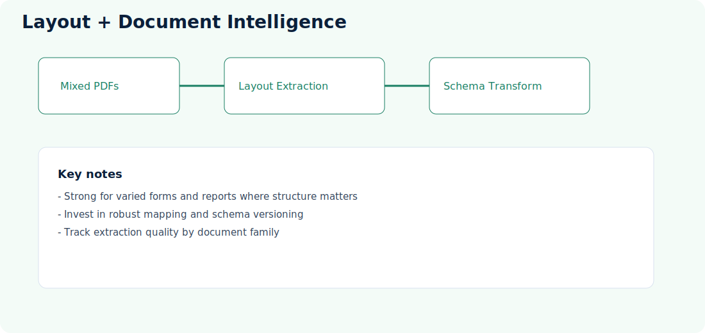
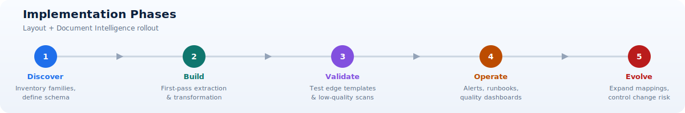

# Layout Processing with Document Intelligence

**Repository:** [PDFs-Layouts-Processing-Fapp-DocIntelligence](https://github.com/Cloud2BR-MSFTLearningHub/PDFs-Layouts-Processing-Fapp-DocIntelligence)

  

## What this approach does

Extracts layout structures (paragraphs, lines, tables, key blocks) from PDFs, then applies transformation logic to produce machine-usable ETL outputs.

This approach is useful when structure matters as much as content, for example when table relationships and section placement drive business meaning.

## Typical flow

1. Receive source documents.
2. Execute Document Intelligence layout extraction.
3. Transform structural outputs into target schema.
4. Apply quality checks and business rules.
5. Deliver structured output for analytics or downstream automation.

## Concepts explained

- Layout extraction: Captures structural signals such as text blocks, lines, tables, and positional boundaries.
- Transformation mapping: Converts generic layout output into business-specific schema and entities.
- Structural validation: Confirms that expected sections, headers, or table patterns exist before integration.
- Versioned mappings: Keeps transformation logic traceable as document formats evolve over time.

## Best fit

- Mixed business documents (reports, forms, statements).
- Workloads where table and positional structure are critical.
- ETL pipelines that need reusable structural extraction.

## Architecture responsibilities

- Ingestion layer: Accepts multiple document types and metadata.
- Extraction layer: Produces comprehensive layout artifacts.
- Mapping layer: Applies deterministic transformation rules.
- Quality layer: Detects mapping failures and schema mismatches.
- Delivery layer: Publishes validated outputs to data and process consumers.

## Strengths

- Flexible extraction for many document types.
- Rich structural output for advanced transformations.
- Reusable document-to-schema transformation layer.

## Design guidance

1. Keep extraction and mapping logic separate to simplify maintenance.
2. Build reusable mapping components for recurring document sections.
3. Maintain a representative golden dataset for regression testing.
4. Capture mapping-level metrics, not only extraction-level metrics.
5. Treat mapping updates as versioned changes with approvals.

## Considerations

- Requires robust transformation mapping.
- Schema drift handling should be versioned.
- Observability is key for extraction quality trends.

## Implementation phases

1. Discover: Inventory document families and define target canonical schema.
2. Build: Implement first-pass extraction and transformation components.
3. Validate: Test against edge templates and low-quality scans.
4. Operate: Add alerts, runbooks, and quality dashboards.
5. Evolve: Expand mappings while controlling change risk through versioning.
