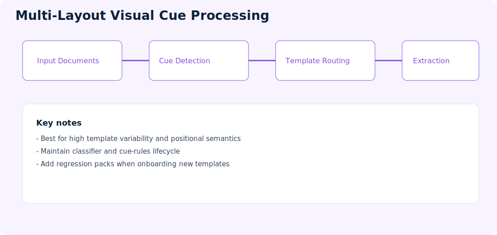
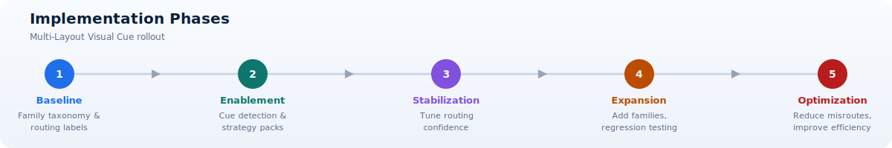

# Multi-Layout Visual Cue Processing

**Repository:** [PDFs-MultiLayout-VisualCue-AzureAI-Document-Processing](https://github.com/Cloud2BR-MSFTLearningHub/PDFs-MultiLayout-VisualCue-AzureAI-Document-Processing)

  

!!! info "At a glance"
    Use this pattern when template families are meaningfully different, can be recognized from stable cues, and benefit from specialized extraction strategies.

> **Best-fit signal:** Family-specific routing is valuable when stable visual differences predict which extraction strategy will perform best.

## What this approach does

Routes each document to a specialized extraction path based on detected layout signatures and visual cues, improving accuracy for highly variable templates.

It combines classification and extraction so each document is processed by the most suitable strategy instead of forcing a one-size-fits-all model.

## Typical flow

1. Ingest document and compute visual/layout features.
2. Classify template or layout family.
3. Select extraction strategy per family.
4. Extract fields and structural data.
5. Consolidate output into normalized schema.

## Concepts explained

- Template family: A group of documents that share similar layout and field positioning patterns.
- Visual cues: Detectable anchors such as labels, markers, stamps, or region-specific signals used to improve routing and extraction reliability.
- Routing strategy: The decision logic that maps each incoming document to the correct extraction pipeline.
- Strategy pack: A maintainable bundle of rules, mappings, and thresholds for a template family.

## Best fit

- Multi-vendor or multi-template document estates.
- Documents where field meaning depends on location and visual markers.
- Programs requiring high extraction precision despite format variance.

## Architecture responsibilities

- Feature layer: Computes layout and cue signals from incoming documents.
- Classification layer: Assigns document family with confidence scoring.
- Extraction layer: Applies family-specific extraction and transformation logic.
- Consolidation layer: Normalizes outputs into a shared contract.
- Monitoring layer: Tracks classification accuracy and drift.

## Strengths

- Better accuracy for heterogeneous templates.
- Separation of routing and extraction concerns.
- Scales through strategy packs per layout family.

## Design guidance

1. Start with the top template families that drive most volume.
2. Implement routing confidence bands and fallback behavior.
3. Build regression suites for each strategy pack before release.
4. Monitor family-level quality metrics to detect drift quickly.
5. Document onboarding steps for net-new template families.

## Considerations

- Requires lifecycle management for cue rules/classifiers.
- Template onboarding process should be formalized.
- Regression testing is important as new templates are introduced.

!!! warning "Never force an uncertain document into a known family"
  A low-scoring best candidate is still uncertain. Preserve an explicit unknown route and safe review path instead of choosing a family by default.

> **Routing principle:** Unknown is a valid classification outcome and must lead to a controlled fallback path.

## Implementation phases

1. Baseline: Define family taxonomy and routing labels.
2. Enablement: Build cue detection and initial strategy packs.
3. Stabilization: Tune routing confidence and exception handling.
4. Expansion: Add families with controlled regression testing.
5. Optimization: Reduce misroutes and improve processing efficiency.

## Visual cue taxonomy

Visual cues are observable features that help distinguish a document family or locate meaning. Use stable business features rather than incidental styling whenever possible.

| Cue type | Examples | Risk |
| --- | --- | --- |
| Text anchor | Form title, vendor name, section heading, field label | Wording and language may change |
| Position | Address block in a consistent region, total near lower-right | Page size and reflow can shift coordinates |
| Graphic | Logo, stamp, barcode, checkbox, signature area | Images can be compressed, replaced, or omitted |
| Color or highlight | Selected option, status band, marked region | Scanning and grayscale conversion can remove color |
| Structural signature | Column count, repeated sections, table geometry | Small revisions can alter structure |
| Metadata | Source channel, vendor ID, file naming convention | Metadata can be missing or untrusted |

Combine independent cues where possible. A routing decision based on a title plus structural signature is generally more robust than one based only on exact coordinates.

## Classification design

Define a taxonomy before implementing classifiers. Families should represent processing differences, not every cosmetic variation. If two templates use the same extraction and validation strategy, they may belong to one family.

The classifier should return:

- Predicted family.
- Confidence or score used by the routing policy.
- Alternative candidates when available.
- Cue evidence or diagnostic features where practical.
- Classifier and taxonomy versions.
- Unknown or unsupported outcome rather than forcing every document into a known family.

Avoid using untrusted filenames or source metadata as the only classification evidence. They can supplement content-based cues but should be validated.

## Classification quality metrics

Overall accuracy can conceal harmful family confusion. Use a confusion matrix and report precision, recall, and support count for each family.

- Precision answers: When the classifier selects this family, how often is it correct?
- Recall answers: Of all documents in this family, how many were identified?
- Confusion pairs identify families repeatedly mistaken for one another.
- Unknown detection measures whether unsupported documents are rejected safely.
- Routing impact measures the downstream extraction or business error caused by a misroute.

Weight errors by business consequence. Confusing two families that share a strategy may be harmless; routing a credit note through a payment-invoice strategy can be significant.

## Routing policy and fallback

Use confidence bands rather than a single pass/fail boundary.

1. High confidence: Route automatically when required cues agree and the family is supported.
2. Medium confidence: Apply secondary checks, alternate classifier, or limited extraction before deciding.
3. Low confidence: Send to classification review or a safe generic path.
4. Unknown: Quarantine or use an explicitly designed unsupported-document workflow.

Never choose an arbitrary family merely because it has the highest score. The best candidate may still be too uncertain for safe automation.

## Strategy-pack contents

A strategy pack should be a governed, versioned unit containing:

- Family definition and representative examples.
- Positive and negative classification cues.
- Preprocessing configuration.
- Extraction model or method.
- Field mappings and normalization rules.
- Validation and confidence policy.
- Exception categories and fallback behavior.
- Golden documents and expected outputs.
- Owner, version, approval status, and support notes.

Keeping these artifacts together makes onboarding, rollback, and audit easier. Shared processors should be referenced rather than copied into every pack.

## Template onboarding procedure

!!! tip "Add negative examples"
  Each family should include documents that look similar but do not belong to it. Negative examples expose confusion risks that positive samples alone cannot reveal.

1. Intake: Capture owner, volume, business use, critical fields, and representative files.
2. Similarity review: Determine whether the template belongs to an existing family.
3. Labeling: Add reviewed family labels and expected business fields to the evaluation set.
4. Cue design: Select stable distinguishing signals and define unknown behavior.
5. Strategy implementation: Configure extraction, mapping, validation, and exceptions.
6. Regression: Run the full classifier and strategy-pack suite, not only the new family.
7. Staged release: Shadow or limit traffic while comparing outcomes.
8. Operations handoff: Document support symptoms, dashboards, owners, and rollback.

## Preventing classifier growth problems

As family count increases, similar templates and sparse examples can reduce classification quality. Use hierarchy where appropriate: first identify broad document type, then vendor or template family. Retire obsolete families, merge equivalent strategies, and measure whether a new family provides enough quality improvement to justify maintenance.

Maintain an unknown-class dataset containing unsupported documents, unrelated files, blank pages, and adversarial or malformed inputs. A classifier evaluated only on known families will appear more reliable than it is in production.

## Regression testing

Test both routing and extraction because a correct extraction strategy is irrelevant if the document is misrouted.

- Family-label regression across all supported templates.
- Cue perturbation tests for scan, rotation, crop, color loss, and compression.
- Similar-family tests focused on known confusion pairs.
- Unknown and unsupported-document rejection tests.
- Strategy output comparison by critical field.
- End-to-end tests confirming canonical contract and downstream behavior.

## Operational metrics

- Classification precision and recall by family.
- Unknown and low-confidence rates.
- Family confusion pairs and business impact.
- Extraction quality after routing.
- New-template detection and onboarding lead time.
- Strategy-pack exceptions and correction volume.
- Quality drift by source, scan characteristics, and release version.

??? failure "Common failure scenarios"
  | Scenario | Detection | Response |
  | --- | --- | --- |
  | New unseen template | Low confidence or extraction validation failure | Unknown route and onboarding intake |
  | Similar templates confused | Confusion matrix and correction reasons | Add discriminating cues or merge strategy |
  | Cue removed in redesign | Family-specific recall drop | Update pack through staged release |
  | Scan removes color cue | Input-quality and cue diagnostics | Use non-color backup cues |
  | Wrong family creates valid-looking output | Cross-field or source reconciliation | Stop delivery and investigate routing policy |
