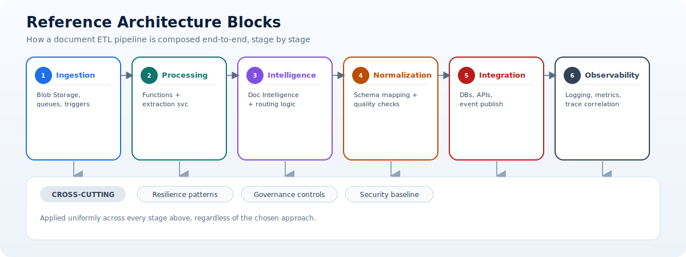

# Architecture Patterns

This page summarizes architecture patterns to operationalize document intelligence and ETL at scale.

Its purpose is to show how pattern choice affects architecture composition, delivery complexity, and platform operating model.

!!! important "Logical stages do not require one service each"
	Preserve clear responsibilities and contracts, but combine deployment units until scaling, security, ownership, or failure-isolation evidence justifies another boundary.

> **Architecture principle:** Separate responsibilities logically first; separate deployments only when operational evidence requires it.

## Reference architecture blocks

- Ingestion: Blob Storage, queues, event triggers.
- Processing: Azure Functions and extraction services.
- Intelligence: Document Intelligence models and routing logic.
- Normalization: Schema mapping and quality validation.
- Integration: Databases, APIs, and event publishing.
- Observability: Logging, metrics, and trace correlation.

## Architecture principles

- Separate concerns by stage so ingestion, extraction, mapping, and integration can evolve independently.
- Design for idempotency to support retries and replay without duplicate side effects.
- Treat schema and routing rules as versioned assets with change control.
- Build for traceability so each output can be linked back to source file, model, and rule versions.
- Favor composable components that can be reused across document families.

## Pattern mapping

| Pattern | Recommended approach |
| --- | --- |
| Stable invoice formats | Invoice + Document Intelligence |
| Broad unstructured docs | Layout + Document Intelligence |
| High template diversity | Multi-Layout Visual Cue |
| Heavy custom orchestration | Invoice + Open Framework |

## Integration patterns

- Event-first integration: Publish document processing outcomes to event streams for decoupled downstream processing.
- API-first integration: Expose validated normalized payloads through governed service endpoints.
- Data-lake integration: Store curated outputs for analytics, BI, and historical benchmarking.
- Hybrid integration: Combine transactional delivery for operations and batch delivery for analytics.

## Resilience patterns

1. Retry transient failures with bounded backoff.
2. Route unrecoverable failures to poison queues with actionable metadata.
3. Implement replay tooling for controlled reprocessing.
4. Use circuit-breaking controls for unstable external dependencies.
5. Add fallback logic for low-confidence extraction outcomes.

!!! tip "Design replay before the first incident"
	Record durable stage state, versions, and idempotency keys from day one. Retrofitting safe replay after partial downstream delivery is significantly harder.

> **Resilience principle:** A retry repeats execution; a safe replay reproduces intent without duplicating business effects.

## Enterprise rollout model

1. Start with one high-volume document domain.
2. Build quality baseline and confidence thresholds.
3. Standardize error handling and remediation workflows.
4. Expand approach catalog by document family.
5. Continuously measure extraction quality and business impact.

## Recommended architecture artifacts

- Canonical data contract for normalized document output.
- Routing and extraction rule catalog with owners and version history.
- End-to-end observability model including key traces and KPIs.
- Exception handling playbook and support runbooks.
- Security and governance control matrix mapped to pipeline stages.

## Stage composition and boundaries

Architecture blocks are logical responsibilities, not a requirement to deploy one service per block. A small workload may combine intake, extraction orchestration, and normalization in one Function App while preserving internal interfaces. A larger workload may separate stages to scale, deploy, and recover independently.

Split a stage when there is evidence of a distinct need:

- It has materially different scaling or latency characteristics.
- It uses a different security boundary or data classification.
- It changes at a different rate or has a separate owner.
- It requires independent retry, replay, or failure isolation.
- Several document domains reuse it as a platform capability.

Every boundary adds contracts, network calls, telemetry, deployment coordination, and failure modes. Prefer the fewest boundaries that satisfy operational requirements.

## Deployment topologies

### Public-cloud service endpoints

Suitable when policy permits controlled public endpoints protected by identity, firewall restrictions, and secure transport. It can simplify initial delivery but requires careful exposure review.

### Private Azure topology

Use virtual-network integration and private endpoints to keep supported service traffic on controlled network paths. Plan DNS resolution, subnet capacity, outbound dependencies, and operational access. Private connectivity does not replace identity authorization.

### Hybrid enterprise topology

Documents or downstream systems may remain on-premises while processing runs in Azure. Use resilient private connectivity, explicit routing, controlled DNS, and durable queues to tolerate intermittent links. Avoid synchronous chains across the hybrid boundary when eventual delivery is acceptable.

### Multi-tenant platform topology

A shared platform can serve several business units while isolating data, identities, quotas, and cost. Define whether isolation occurs by subscription, resource group, storage account, database partition, or application tenant. The design should match regulatory and blast-radius requirements rather than applying one isolation model universally.

## Synchronous versus asynchronous processing

Synchronous APIs are useful when callers need an immediate result and documents are small enough to meet a bounded response time. They expose callers directly to extraction latency and dependency failures.

Asynchronous processing is generally better for large documents, variable AI latency, bursty volume, human review, and replay. The caller submits work, receives a document or job ID, and observes status through callback, event, or query.

If both modes are required, keep one processing pipeline behind separate submission experiences. Do not build unrelated logic paths that produce inconsistent outcomes.

## Idempotency by stage

- Ingestion: Deduplicate source events using event ID, source identity, or content hash according to business policy.
- Extraction: Repeated calls may incur cost; cache or reference completed results when input and configuration are unchanged.
- Normalization: Produce deterministic output for the same raw response and rule version.
- Persistence: Use conditional writes, unique keys, or upsert rules that cannot silently overwrite incompatible state.
- Integration: Send an idempotency key and store acknowledgement so retries do not duplicate business transactions.
- Replay: Record the reason, requested version, and target behavior; replay must not be indistinguishable from first processing.

## Availability and recovery objectives

Define requirements from business impact before selecting multi-region complexity.

- Recovery time objective (RTO): Maximum acceptable time to restore processing.
- Recovery point objective (RPO): Maximum acceptable amount of state or work that can be lost.
- Processing service level: Target completion time and success rate for accepted documents.
- Backlog recovery objective: How quickly queued work must return to normal after an outage.

A durable queue can allow processing to pause without losing documents, which may satisfy many workloads without active-active regional processing. High availability is not the same as disaster recovery: availability handles component failure; disaster recovery restores service after a broader loss.

??? info "Multi-region deployment patterns"
	**Active-passive**

	One region processes traffic while a secondary region contains deployable infrastructure and replicated state. It is simpler to govern but requires tested failover and an acceptable recovery time.

	**Active-active**

	Multiple regions process simultaneously. This can improve availability and proximity but introduces document ownership, duplicate prevention, data consistency, model availability, and cross-region observability challenges.

	**Regional ingestion with centralized processing**

	Documents enter through regional boundaries for residency or latency, then approved metadata or content moves to a central processor. Verify whether movement satisfies classification and residency policy.

	For any topology, document service availability by region, storage and database replication mode, secret and configuration recovery, DNS or routing failover, and how queued work is reconciled after failback.

## Data recovery and replay

Retain enough durable state to restart safely from the last completed stage. A replay tool should support scoped selection, dry-run estimation, target version, authorization, rate limiting, progress monitoring, cancellation, and audit logging.

Replay scenarios include transient dependency recovery, mapping correction, model upgrade evaluation, downstream redelivery, and historical backfill. Not all should update authoritative business records. Distinguish evaluation replay from production redelivery.

## CI/CD reference flow

1. Source checks: Markdown/config validation, linting, unit tests, secret detection, dependency and infrastructure scanning.
2. Build: Produce immutable application and infrastructure artifacts tied to a commit.
3. Development deployment: Run smoke and integration tests with synthetic data.
4. Test deployment: Execute golden-dataset, contract, security, and resilience tests.
5. Preproduction: Validate production-like networking, quotas, scale, dashboards, alerts, and runbooks.
6. Production rollout: Use staged traffic or version routing with defined rollback signals.
7. Post-deployment verification: Confirm end-to-end synthetic transaction, telemetry, and downstream acknowledgement.

Separate environments by identity and data as well as naming. Production credentials or documents should not be copied into lower environments without explicit approved controls.

## Contract and breaking-change management

Maintain contracts for events, APIs, normalized payloads, review tasks, and processor boundaries. Assign an owner and compatibility policy to each.

- Add optional fields without requiring immediate consumer change.
- Publish a new major version for semantic or structural breaking changes.
- Run consumer contract tests before promotion.
- Support parallel versions during a defined migration period.
- Monitor traffic by version and contact remaining consumers before retirement.
- Preserve provenance so historical records can be interpreted under their original contract.

Blue-green deployment of application code does not by itself make a data contract change safe. The old and new paths may write incompatible state. Plan schema evolution and rollback together.

## Capacity planning

Estimate capacity using documents per interval, pages per document, extraction calls, average and tail processing time, peak factor, retry rate, and human-review rate. Include downstream throughput and service quotas.

Monitor:

- Queue length and oldest-message age.
- Stage throughput and percentile latency.
- Function concurrency and dependency saturation.
- Throttling and retry volume.
- Storage, database, and telemetry growth.
- Human-review backlog and staffing capacity.

Test backlog recovery after a simulated outage. A system that handles normal arrival rate but cannot drain accumulated work may miss business deadlines long after service is restored.

## Architecture decision records

Use concise records for decisions such as synchronous versus asynchronous processing, canonical contract, tenancy isolation, regional topology, retention, extraction provider, and review workflow. Record context, constraints, options, decision, consequences, owner, and review trigger. Revisit decisions when volume, regulation, service capability, or business risk changes.
