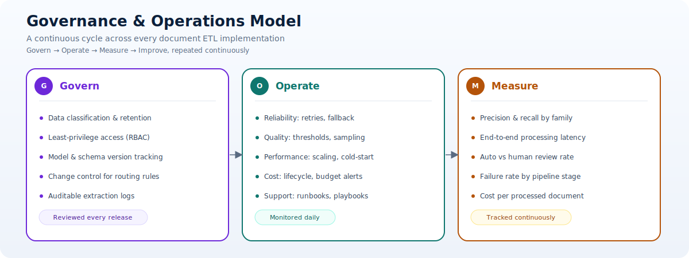
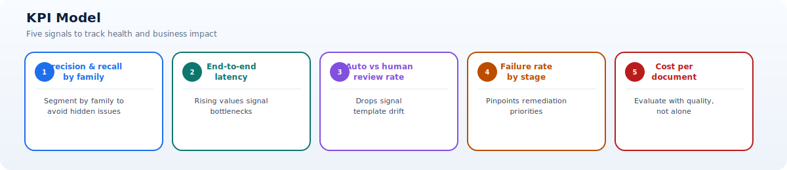

# Governance and Operations

This page defines the operating model needed to keep document ETL solutions reliable, auditable, and cost-effective as scope grows.

## Governance priorities

- Define data classification and retention per document type.
- Enforce role-based access and least privilege.
- Track model versions and extraction schema versions.
- Require change control for routing and extraction rules.
- Maintain auditable logs for extraction and downstream actions.

## Governance concepts explained

- Data classification policy: Defines sensitivity levels and handling requirements for each document category.
- Control ownership: Assigns accountable owners for models, mappings, routing rules, and production approvals.
- Change governance: Ensures modifications are reviewed, tested, and documented before deployment.
- Evidence readiness: Captures artifacts needed for internal controls and external audits.
- Policy-to-implementation mapping: Connects compliance requirements to concrete technical controls.

## Operational excellence checklist

| Area | Practice |
| --- | --- |
| Reliability | Retry policies, poison queue handling, fallback flow |
| Quality | Confidence thresholds, sampling review, benchmark set |
| Performance | Batch strategy, queue scaling, cold-start mitigation |
| Cost | Workload-based scaling, storage lifecycle, budget alerts |
| Support | Runbooks, alert routing, incident response playbooks |

## Day-2 operating practices

1. Review extraction quality trends weekly by document family.
2. Track top exception causes and prioritize recurring remediation.
3. Validate confidence thresholds quarterly against business outcomes.
4. Conduct change-impact reviews for new templates and mappings.
5. Reconcile operational costs with document volume and SLA targets.

## Release management guidance

- Use staged rollouts for routing and extraction rule changes.
- Require regression tests on representative golden datasets.
- Version outputs so downstream systems can adopt changes safely.
- Include rollback paths for mapping and model updates.
- Document release decisions and approvals for traceability.

## KPI model

- Extraction precision and recall by document family.
- End-to-end processing latency.
- Auto-processing rate vs human review rate.
- Failure rate by pipeline stage.
- Cost per processed document.

## KPI interpretation guidance

- Rising latency with stable volume often indicates queue, function, or dependency bottlenecks.
- Decreasing auto-processing rate may signal template drift or threshold misalignment.
- High failure concentration in one stage indicates focused remediation opportunities.
- Cost per document should be evaluated alongside quality, not in isolation.
- Family-level KPI segmentation prevents averages from hiding localized problems.

## Operating model and accountability

Governance is effective only when decisions have named owners. Define responsibility at platform, document-domain, and business-process levels.

| Role | Accountabilities |
| --- | --- |
| Business process owner | Acceptance policy, business risk, exception staffing, outcome KPIs |
| Document-domain owner | Template catalog, field definitions, golden data, mapping and quality decisions |
| Platform owner | Shared runtime, infrastructure, contracts, deployment controls, support model |
| Model or extraction owner | Evaluation, model/API version, confidence policy, drift review |
| Security owner | Threat model, access, network, secrets, monitoring, incident control |
| Data steward | Classification, retention, quality definitions, lineage, deletion requirements |
| Operations lead | Alerts, incidents, runbooks, service levels, problem management |
| Change approver | Confirms evidence and risk before production release |

Use a RACI or equivalent matrix for model changes, threshold changes, mapping changes, new document families, infrastructure changes, replay, and emergency access. Avoid approval chains where everyone is consulted but nobody is accountable.

## Change classes and approvals

Not every change carries the same risk.

- Standard change: Pre-approved low-risk operational action with a tested procedure, such as scaling within an approved range.
- Normal change: Reviewed change requiring test evidence and scheduled deployment, such as a mapping update.
- High-risk change: Material impact on critical fields, security boundary, contract, or data movement; requires broader approval and staged rollout.
- Emergency change: Time-sensitive remediation with limited process, explicit authority, enhanced logging, and retrospective review.

A change record should include scope, affected families, versions, quality comparison, contract impact, security impact, rollout, rollback, owner, and monitoring window.

## Evidence package for releases

For meaningful production changes, retain:

- Pull request and approved requirements.
- Automated test, contract, and golden-dataset results.
- Quality comparison by critical field and family.
- Security and dependency scan results.
- Infrastructure plan and policy evaluation.
- Data-contract compatibility evidence.
- Deployment approval, artifact identity, and release timestamp.
- Post-release verification and observed metrics.

Automate evidence capture in CI/CD where possible. Manual screenshots are difficult to reproduce and easy to omit.

## Incident classification

Classify incidents by business and data impact, not only technical symptom.

| Severity example | Example impact | Expected response principle |
| --- | --- | --- |
| Critical | Unsafe financial output delivered, sensitive-data exposure, widespread outage | Immediate command structure, containment, executive and security escalation |
| High | Major processing failure or quality degradation with business deadline risk | Rapid owner engagement, workaround, frequent communication |
| Medium | Limited family or stage affected with available workaround | Prioritized remediation and monitored backlog |
| Low | Minor defect, documentation issue, or non-urgent improvement | Normal backlog and scheduled correction |

Define exact response and communication targets according to organizational policy. Ensure alert severity maps to incident severity carefully; one failed document is not necessarily a critical platform incident, while valid-looking incorrect financial output may be.

## Incident response lifecycle

1. Detect: Alert, user report, quality control, or security signal identifies a symptom.
2. Triage: Determine scope, affected versions, families, documents, and downstream impact.
3. Contain: Pause unsafe routes, disable a version, restrict access, or stop delivery while preserving evidence.
4. Recover: Restore known-good behavior, drain queues safely, and replay only authorized work.
5. Communicate: Provide impact, workaround, recovery status, and next update to stakeholders.
6. Learn: Record root cause, contributing conditions, detection gap, and corrective actions.

Track incidents to problem records when the underlying condition can recur. Verify corrective actions through tests or control changes rather than closing them after documentation alone.

## Runbook structure

Every actionable alert should link to a runbook containing:

- Symptom and business impact.
- Dashboard and queries needed for diagnosis.
- Safe first actions and actions that require approval.
- Common causes and discriminating checks.
- Retry, replay, rollback, or failover procedure.
- Escalation contacts and communication template.
- Evidence to preserve.
- Verification that service and data are healthy afterward.

Test runbooks through exercises. A document that is correct but cannot be followed during an incident is not an operational control.

## Quality governance cadence

- Daily: Review alerts, queue age, failures, review backlog, and critical exceptions.
- Weekly: Analyze family-level quality, correction reasons, latency, and repeated failures.
- Monthly: Review cost, capacity, access, template onboarding, and problem backlog.
- Quarterly or risk-based: Recalibrate thresholds, review golden data, test recovery, and reassess controls.
- Release-based: Compare quality and behavior before and after every material model, rule, or mapping change.

The cadence should reflect volume and risk. Low-volume high-impact processes may require review per transaction rather than relying on trend analysis.

## Cost governance

Build cost allocation tags or dimensions into subscriptions, resources, telemetry, and document metadata. Attribute cost by business domain, environment, document family, and major processing stage where feasible.

Review:

- AI calls and pages processed, including retries.
- Function execution and hosting plan utilization.
- Storage capacity, operations, replication, and retention tier.
- Database request or compute consumption.
- Monitoring ingestion and retention.
- Network transfer and private connectivity.
- Human-review and support effort.

Set budgets and anomaly alerts, but investigate cost together with quality and volume. A lower unit cost caused by skipping validation is not an optimization. Useful triggers include cost per successful document rising beyond tolerance, retry cost increasing, storage growth exceeding forecast, or review effort offsetting automation benefits.

## Data retention and defensible deletion

Maintain a retention schedule by artifact type and classification:

- Source documents.
- Preprocessed derivatives and page images.
- Raw AI responses.
- Normalized business records.
- Human-review tasks and corrections.
- Logs, traces, metrics, and security events.
- Backups, replicas, exports, and evaluation datasets.

Deletion should be authorized, traceable, and propagated to relevant derived stores. Legal hold or investigation requirements can override normal deletion. Test deletion workflows and document known technical limitations.

Do not retain sensitive source content merely because it may be useful for future model improvement. Establish a documented purpose, access boundary, retention period, and approval for evaluation datasets.

## Access review

Review human and workload access separately. Human reviews should cover privileged roles, reviewer permissions, emergency accounts, and inactive users. Workload reviews should cover managed identities, service principals, role scope, credentials, and unused permissions.

Require stronger oversight for permissions that allow reading source documents, changing routing or thresholds, replaying work, approving exceptions, or delivering to financial systems. Preserve access-review evidence and remediation actions.

## Service-level model

Define service indicators before promising service levels:

- Availability of document submission.
- Time from acceptance to validated output.
- Completion success excluding documented invalid inputs.
- Maximum age of the oldest processing message.
- Human-review response by priority.
- Recovery time after dependency or regional failure.
- Quality target for critical fields on a defined evaluation population.

State exclusions and measurement windows. Quality service levels require stable ground truth and sampling; they cannot be inferred only from model confidence.

## Operational readiness review

Before production launch, confirm:

1. Owners, support schedule, service levels, and escalation are approved.
2. Dashboards, alerts, traces, and synthetic checks are working.
3. Runbooks cover major failure and recovery scenarios.
4. Retry, poison queue, replay, backup, and restore are tested.
5. Quality thresholds and exception staffing are validated with expected volume.
6. Security, retention, access, and evidence controls are implemented.
7. Capacity and quota headroom cover peak and backlog recovery.
8. Downstream consumers have accepted contracts and failure behavior.
