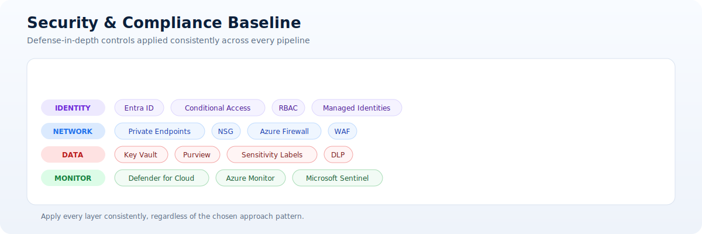
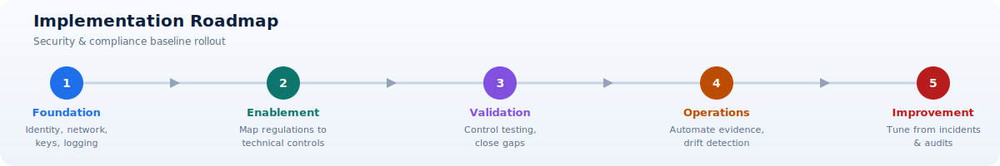

# Security and Compliance Baseline

Document ETL pipelines handle sensitive data, so security controls must be integrated from day one.

This baseline applies to all approach patterns and should be implemented as shared platform standards, not optional per-project add-ons.

## Baseline controls

- Identity-first access with Microsoft Entra ID.
- Private network access paths where possible.
- Secrets stored only in Azure Key Vault.
- Encryption in transit and at rest.
- Centralized audit and security monitoring.

## Security concepts explained

- Zero trust: Never assume trust based on network position; validate identity, context, and policy at each access point.
- Least privilege: Grant only the minimum permissions required for each identity and workload.
- Defense in depth: Apply complementary controls across identity, network, data, and monitoring layers.
- Segregation of duties: Separate build, deploy, and approve responsibilities to reduce risk.
- Continuous assurance: Treat compliance as an ongoing control process, not a one-time checklist.

## Security services to apply

| Control domain | Services |
| --- | --- |
| Identity and access | Microsoft Entra ID, Conditional Access, RBAC, Managed Identities |
| Network security | Private Endpoints, NSG, Azure Firewall, WAF |
| Data security | Key Vault, Purview, sensitivity labels, DLP |
| Monitoring and response | Defender for Cloud, Azure Monitor, Microsoft Sentinel |

## Baseline by pipeline layer

| Pipeline layer | Minimum controls |
| --- | --- |
| Ingestion | Private endpoints, upload validation, malware scanning policy, immutable logging |
| Processing | Managed identities, least-privilege RBAC, secure configuration, runtime patch governance |
| Extraction and enrichment | Approved model endpoints, prompt and input controls, output validation |
| Storage and integration | Encryption keys in Key Vault, data classification tags, controlled API scopes |
| Operations and support | Centralized SIEM onboarding, alert routing, incident response runbooks |

## Compliance readiness

- Define document data classification matrix.
- Tag and enforce data residency requirements.
- Maintain evidence artifacts for audits.
- Review access logs and policy drift regularly.

## Implementation roadmap

1. Foundation: Establish identity, network, key management, and logging baseline.
2. Enablement: Map regulatory requirements to enforceable technical controls.
3. Validation: Run control testing and close policy gaps before production launch.
4. Operations: Automate evidence collection and policy drift detection.
5. Improvement: Continuously tune controls based on incidents and audit findings.

!!! note
    Security controls should be applied consistently across all four approaches to avoid governance fragmentation.
