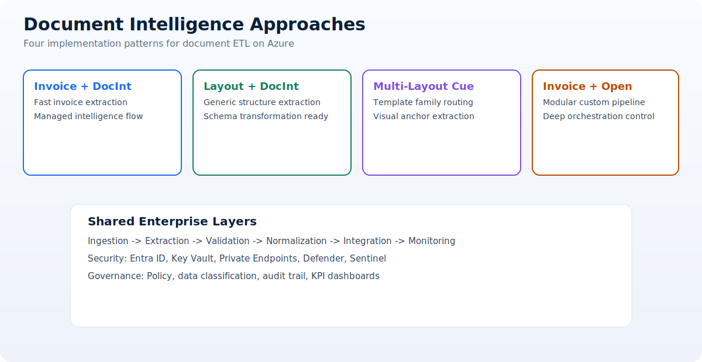

# Document Intelligence Approaches

This documentation presents a practical guide for designing document ETL pipelines using Azure services and implementation patterns from four real repositories.

## What you will learn

- How each approach handles ingestion, extraction, normalization, and output.
- Which approach is best for fixed invoices vs variable layouts.
- Where visual-cue analysis adds value for complex documents.
- When to use Open Framework-based pipelines for extensibility.

## Repository cards

  <a class="home-card" href="https://github.com/Cloud2BR-MSFTLearningHub/PDFs-Invoice-Processing-Fapp-DocIntelligence">
    <h3>PDFs-Invoice-Processing-Fapp-DocIntelligence</h3>
    
Direct implementation repository for invoice extraction with Document Intelligence.

  </a>

  <a class="home-card" href="https://github.com/Cloud2BR-MSFTLearningHub/PDFs-Layouts-Processing-Fapp-DocIntelligence">
    <h3>PDFs-Layouts-Processing-Fapp-DocIntelligence</h3>
    
Direct implementation repository for layout-first document extraction.

  </a>

  <a class="home-card" href="https://github.com/Cloud2BR-MSFTLearningHub/PDFs-MultiLayout-VisualCue-AzureAI-Document-Processing">
    <h3>PDFs-MultiLayout-VisualCue-AzureAI-Document-Processing</h3>
    
Direct implementation repository for multi-layout and visual-cue routing.

  </a>

  <a class="home-card" href="https://github.com/Cloud2BR-MSFTLearningHub/PDFs-Invoice-Processing-Fapp-OpenFramework">
    <h3>PDFs-Invoice-Processing-Fapp-OpenFramework</h3>
    
Direct implementation repository for open-framework invoice pipelines.

  </a>

!!! tip
    Start with the [Overview and Decision Guide](02-approaches/index.md) to select the right implementation quickly.
