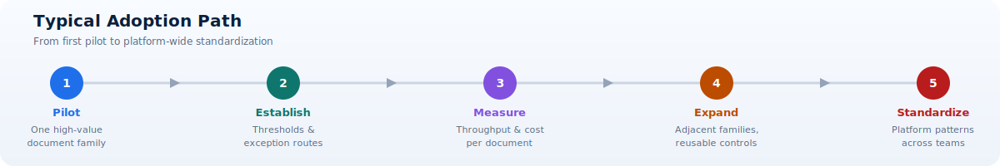

# Document Intelligence Approaches

This documentation presents a practical guide for designing document ETL pipelines with Azure services and implementation patterns from four real repositories.

The goal is to help architecture, platform, and delivery teams choose the right implementation path for each document domain, then scale that path with security, governance, and operations built in.

## Included repositories

| Repository | Best for | Core pattern |
| --- | --- | --- |
| <a href="https://github.com/Cloud2BR-MSFTLearningHub/PDFs-Invoice-Processing-Fapp-DocIntelligence" target="_blank" rel="noopener noreferrer">PDFs-Invoice-Processing-Fapp-DocIntelligence</a> | Standardized invoices | Managed extraction using Document Intelligence invoice capabilities |
| <a href="https://github.com/Cloud2BR-MSFTLearningHub/PDFs-Layouts-Processing-Fapp-DocIntelligence" target="_blank" rel="noopener noreferrer">PDFs-Layouts-Processing-Fapp-DocIntelligence</a> | Generic documents and forms | Layout-first extraction and transformation |
| <a href="https://github.com/Cloud2BR-MSFTLearningHub/PDFs-MultiLayout-VisualCue-AzureAI-Document-Processing" target="_blank" rel="noopener noreferrer">PDFs-MultiLayout-VisualCue-AzureAI-Document-Processing</a> | Multiple templates with positional cues | Visual cue and multi-layout routing |
| <a href="https://github.com/Cloud2BR-MSFTLearningHub/PDFs-Invoice-Processing-Fapp-OpenFramework" target="_blank" rel="noopener noreferrer">PDFs-Invoice-Processing-Fapp-OpenFramework</a> | Custom invoice orchestration | Open framework pipeline with extensible stages |

## Core concepts explained

- Document ETL: A pipeline that ingests source documents, extracts structured meaning, transforms that data to business-ready schema, and loads it into downstream systems.
- Pattern selection: You do not implement one universal pipeline for every document type. You select a pattern based on document variability, extraction accuracy targets, and integration complexity.
- Managed versus open orchestration: Managed services can accelerate delivery and reduce maintenance, while open frameworks provide deeper customization and ownership.
- Shared enterprise layers: Regardless of pattern, each solution still needs identity, observability, quality controls, exception handling, and compliance controls.

### What document ETL includes

Document ETL is broader than optical character recognition. OCR converts visible characters into machine-readable text, but a production document pipeline must also determine which text represents a business field, validate that field, normalize it, preserve traceability, and deliver it to a trusted destination. For example, reading `1,250.00` from an invoice is only extraction. The pipeline must still determine whether that value is a subtotal, tax amount, or total; identify its currency; compare it with line items; and map it to the downstream finance contract.

A complete implementation normally includes these responsibilities:

1. Intake and file validation: Confirm format, size, integrity, origin, and required metadata before processing.
2. Classification and routing: Determine document type or template family and select an appropriate extraction path.
3. Extraction: Recover text, tables, selection marks, layout, and domain-specific entities.
4. Validation and normalization: Apply schema, confidence, arithmetic, referential, and business-rule checks.
5. Exception management: Route uncertain or invalid records to retry, quarantine, or human review.
6. Integration: Publish a versioned business payload to operational and analytical systems.
7. Operations and governance: Monitor quality, latency, cost, access, model versions, and audit evidence.

## Audience and responsibilities

This documentation is intended for several roles that make different decisions about the same pipeline.

| Role | Primary questions | Typical outputs |
| --- | --- | --- |
| Business owner | Which process is valuable enough to automate, and what error rate is acceptable? | Business case, acceptance policy, exception ownership |
| Solution architect | Which pattern satisfies quality, integration, security, and recovery requirements? | Reference architecture, service boundaries, non-functional requirements |
| Data or AI engineer | How are documents classified, extracted, evaluated, and improved? | Extraction configuration, mappings, evaluation datasets, quality reports |
| Application engineer | How are triggers, APIs, queues, contracts, and retries implemented? | Functions, processors, integration adapters, automated tests |
| Platform engineer | How are services deployed, secured, observed, and scaled consistently? | Infrastructure as code, policies, dashboards, deployment pipelines |
| Security and compliance owner | What data is processed, where does it travel, and how is evidence retained? | Control matrix, risk assessment, retention and access policies |
| Operations team | How are incidents detected, triaged, replayed, and communicated? | Alerts, runbooks, support queues, service-level reporting |

## Readiness prerequisites

Before selecting an approach, establish a minimum evidence base. A technically impressive prototype can still fail in production if it is built from a small or unusually clean sample.

- Representative documents: Collect examples across vendors, layouts, languages, scan quality, page counts, handwritten annotations, and historical variations.
- Ground truth: Record the expected fields and values for a reviewed sample. This becomes the baseline for measuring extraction quality.
- Business rules: Define required fields, valid ranges, cross-field checks, duplicate handling, and acceptance criteria.
- Volume profile: Estimate average and peak documents per hour, pages per document, payload size, and seasonal spikes.
- Integration contract: Identify downstream owners, required schema, delivery method, latency expectations, and replay behavior.
- Data classification: Determine whether documents include personal, financial, confidential, regulated, or residency-restricted information.
- Exception owner: Assign a team that can review uncertain documents and correct business data within a defined response time.
- Operational ownership: Identify who supports the pipeline after launch and who approves extraction, mapping, or model changes.

!!! warning
    Do not use a demo sample as the production quality baseline. A useful evaluation set should include common documents, rare variants, poor-quality inputs, and known failure cases.

## How to use this documentation

1. Start in [Overview and Decision Guide](02-approaches/index.md) to select a pattern based on document characteristics and team constraints.
2. Review [Fundamentals](01-fundamentals/index.md) to understand the common Azure baseline and service interactions.
3. Open the selected deep-dive in [Approaches Catalog](02-approaches/index.md) and validate architecture fit, strengths, and watchouts.
4. Apply [Architecture Patterns](03-enterprise-design/architecture-patterns.md), [Governance and Operations](03-enterprise-design/governance-operations.md), and [Security and Compliance Baseline](04-security/index.md) before production rollout.

## Typical adoption path

1. Pilot with one high-value document family.
2. Establish confidence thresholds, quality checks, and exception routes.
3. Measure throughput, accuracy, and cost per document.
4. Expand to adjacent document families with reusable controls.
5. Standardize platform patterns across teams.

### Stage exit criteria

Each adoption stage should have measurable exit criteria instead of relying on stakeholder impressions.

| Stage | Evidence required before proceeding |
| --- | --- |
| Pilot | Representative evaluation set, baseline precision/recall, documented unsupported cases, initial cost estimate |
| Establish | Approved confidence policy, normalized data contract, exception workflow, security baseline, telemetry |
| Measure | Stable quality and latency trends, categorized failures, reviewed cost drivers, support ownership |
| Expand | Regression suite, repeatable onboarding process, versioned mappings, capacity plan |
| Standardize | Reusable infrastructure modules, common controls, service catalog, governance and support model |

## Defining success

Extraction accuracy alone does not show whether the automation is valuable. Track a balanced set of technical, operational, and business measures.

- Field quality: Precision, recall, and exact-match rate by critical field and document family.
- Straight-through processing: Percentage of documents completed without human intervention.
- Exception quality: Percentage of exceptions that truly required review, plus average review time.
- Processing performance: End-to-end latency and throughput at average and peak load.
- Reliability: Successful completion rate, retry rate, poison-message rate, and recovery time.
- Business impact: Manual effort avoided, processing cycle-time reduction, duplicate prevention, and downstream correction rate.
- Unit economics: Total processing and support cost per document, page, or successful business transaction.

Targets must be defined by use case. A field that triggers payment should generally have stricter acceptance rules than a descriptive field used only for search. The goal is not to maximize automation at any cost; it is to automate decisions only when available evidence supports the business risk.

## Common pitfalls

### Treating every document as one family

Combining materially different templates into one undifferentiated path often hides weak performance. Segment quality by document family and route documents deliberately.

### Using one confidence threshold

A single global threshold ignores field criticality and model behavior. Calibrate thresholds per field or field tier using reviewed outcomes, and combine confidence with deterministic business checks.

### Ignoring the exception workflow

Low-confidence outputs do not disappear. Without a staffed review process, exceptions accumulate and business users lose trust. Define queue ownership, response expectations, correction capture, and replay behavior before launch.

### Coupling extraction to downstream systems

Writing model output directly into an ERP or database exposes consumers to provider-specific schema changes. Introduce a canonical contract and version it independently from extraction implementation.

### Measuring only averages

Average accuracy can look acceptable while one vendor or template performs poorly. Segment quality, latency, and exceptions by family, source, language, model version, and processing stage.

### Underestimating ongoing ownership

Managed AI reduces model-building effort but does not remove template drift, integration changes, security reviews, cost management, or support work. Include ongoing operations in the business case.

## Pattern choice is not permanent

Organizations can combine approaches or evolve between them. A stable invoice population may start with the managed invoice pattern, while unusual vendors are routed to a visual-cue or custom path. A layout-first implementation can later add family-specific strategies when evidence shows that generic mapping is no longer sufficient.

Preserve migration options by keeping ingestion, canonical output, telemetry, and downstream integration contracts independent from the extraction strategy. This allows the implementation behind the contract to change without forcing every consumer to change at the same time.

## Learning outcomes

- Identify the right approach from document complexity and business outcomes.
- Understand architecture building blocks for each pattern.
- Apply enterprise considerations for operations, security, and governance.
- Build a rollout plan from PoC to production.

!!! tip
    Start with the [Overview and Decision Guide](02-approaches/index.md) to select the right implementation quickly.
